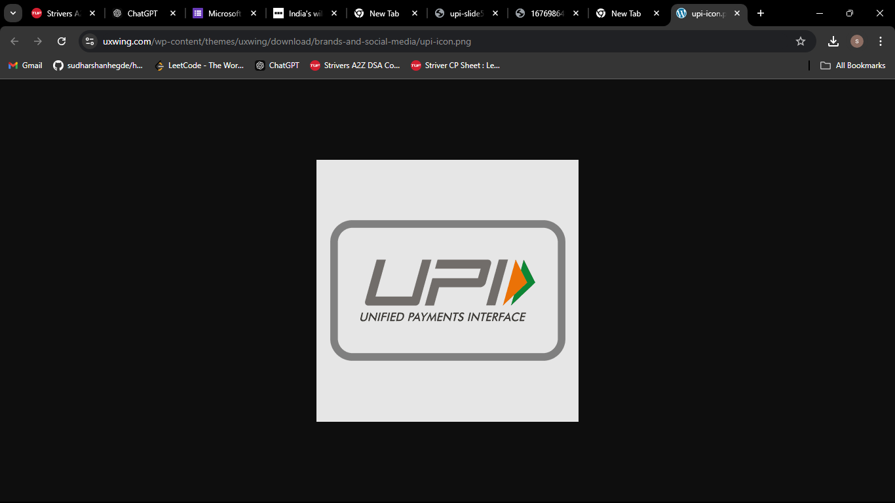

# UPI: Revolutionizing Digital Payments and Enhancing User Experience

## Introduction

### Brief Overview of UPI

  

Imagine a world where making payments is as easy as sending a message—no complicated bank details, no waiting for hours for transactions to clear. This vision turned into reality in 2016 with the introduction of **Unified Payments Interface (UPI)** by **NPCI**. Initially designed to simplify payments for everyday users, UPI has since become a cornerstone of India’s digital payments ecosystem, transforming how millions of people handle money on a daily basis. By 2023, UPI had not only empowered individuals but also small businesses, offering an accessible and cost-effective payment method.

### Objective of the Case Study

  

This case study aims to analyze the economic impact of UPI on India's digital economy. By evaluating how UPI has accelerated digital adoption across various sectors, from small businesses to large enterprises, the study will investigate its role in driving cashless transactions and the growth of digital commerce. It will also assess UPI’s potential for expanding into international markets.

---

## Background and Context

### Pre-UPI Payment Systems

  

As India’s economy began to digitize rapidly, especially post-demonetization, it became evident that the existing payment infrastructure couldn’t scale to meet the rising demand. Traditional systems like **NEFT** and **RTGS** were slow and operated during specific banking hours, while digital wallets were limited by transaction caps and security concerns.

**UPI** addressed these issues by offering a scalable, robust, and secure digital payment infrastructure. Using **APIs**, UPI could easily integrate with various financial institutions and apps, providing a **secure** and **encrypted** platform for **real-time** transactions. With **strong authentication** measures, such as two-factor authentication and encryption, UPI ensured both **scalability** and **safety**, becoming a trusted platform for millions of users.

---

## Core Features of UPI

  

- **Interoperability Across Banks:** UPI allows seamless money transfers between banks without requiring IFSC codes or extensive bank details.
- **Virtual Payment Address (VPA):** Users can transact easily using a simple VPA, replacing the need for bank account numbers.
- **24/7 Accessibility:** UPI operates round-the-clock, making it available anytime, including weekends and holidays.
- **Request Money Feature:** The ability to request payments is particularly beneficial for merchants and service providers.

### Additional Features

- **Instant Settlements:** Transactions are settled instantly, enhancing the speed of payments and making it ideal for both personal and business transactions.
- **Multiple Bank Accounts:** Users can link multiple bank accounts to a single UPI ID, allowing for easy management of funds across different banks.
- **Transaction Limits:** UPI has daily transaction limits, providing a layer of security for users while still allowing for substantial amounts to be transferred.
- **Enhanced Security Features:** UPI incorporates two-factor authentication, PINs, and encryption, ensuring secure transactions.
- **Integration with Other Services:** UPI can be integrated with various apps for bill payments, shopping, and utility payments, making it versatile for daily use.
- **Merchant Discounts and Offers:** Many merchants provide discounts or cashbacks for UPI transactions, incentivizing users to adopt the platform.
- **Easy Reconciliation:** For businesses, UPI simplifies the reconciliation process with real-time transaction data available for tracking.
- **QR Code Payments:** Users can make payments by scanning QR codes, which is a quick and efficient method for in-person transactions.
- **Support for International Transactions:** Some UPI services offer the ability to make international payments, expanding its utility for users traveling abroad or dealing with foreign clients.

- **User-Friendly Interface:** The UPI apps are designed for ease of use, making it accessible for users of all tech-savviness levels.

---

##  UPI Architecture Overview:

  

- Mobile Applications as User Interfaces:
  - Users can access UPI through bank apps, third-party apps (like Google Pay, PhonePe), Internet Banking, and the USSD service (*99#) for non-smartphone users.
  - This variety allows UPI to cater to both smartphone and feature phone users, enhancing its accessibility.

- Banks as Payment Service Providers (PSPs):
  - Banks serve as intermediaries, offering standard interfaces that interact with the UPI system.
  - They facilitate transactions between users' bank accounts, ensuring compliance with UPI protocols.

- Third-Party Apps:
  - Third-party apps like Google Pay and PhonePe operate under banks as PSPs, focusing on collection and transaction initiation. These apps provide users a simplified experience without directly accessing banking infrastructure.

- Central Repository:
  - A central repository ensures secure handling of transactions, verification, and data storage. This layer is crucial for ensuring the integrity and traceability of every UPI transaction.

- Unified Payment Interface (UPI):
  - The UPI system, managed by NPCI, is the core platform that handles real-time payment processing, connecting various banks, apps, and systems.
  - It supports multiple transaction types, including peer-to-peer transfers, bill payments, and merchant payments.

- Underlying Payment Systems:
  - UPI integrates with existing payment systems like:
    - APBS (Aadhaar Payments): for Aadhaar-based transfers.
    - IMPS: for real-time interbank transfers.
    - AEPS (Aadhaar Enabled Payment System): for transactions using biometric authentication.
    - RuPay: for card payments.
    - eCommerce: for online transactions.
  
- NPCI's Role:
  - The NPCI (National Payments Corporation of India) governs the UPI ecosystem, ensuring seamless interoperability across banks and platforms while maintaining security and reliability.

This modular architecture allows UPI to facilitate instant, secure, and affordable digital payments, revolutionizing India's payment landscape.

---

## User Experience Enhancements

  

### Ease of Use
- **Minimal Information Required:** By eliminating the need for long account details and IFSC codes, UPI has greatly simplified the transaction process for users.
- **One-Click Payments:** UPI offers **one-click payments**, reducing the number of steps for completing a transaction and making it faster and more intuitive.
- **Unified Interface Across Apps:** Despite different platforms (Google Pay, PhonePe, etc.), UPI offers a **consistent and familiar user interface** across all apps, improving usability.
- **QR Code Scanning:** UPI enables users to scan QR codes for payments, removing the need for entering any details at all and enhancing the experience for in-person payments.
- **Customizable Virtual Payment Addresses (VPAs):** Users can create easy-to-remember VPAs (like an email or nickname) for their accounts, making transactions even simpler.
- **Seamless App Integration:** UPI integrates with various banking and non-banking apps, allowing users to manage payments without switching platforms.
- **Transaction History and Notifications:** Users receive real-time notifications and have easy access to transaction histories, improving transparency and control.
- **Voice-Enabled Payments:** Some UPI apps offer **voice-enabled features** for easier transactions, enhancing accessibility for visually impaired or tech-challenged users.
  
### Financial Inclusion
- **Low Entry Barriers:** UPI has a low entry barrier with simple account setup and minimal documentation, allowing users without advanced technical knowledge or access to extensive paperwork to join the financial system.
- **Support for Feature Phones:** With solutions like **UPI 123PAY**, even feature phone users can make UPI payments without needing a smartphone or internet connection, driving inclusion.
- **Affordable Transaction Costs:** UPI transactions are often **low-cost or free**, making it an affordable solution for all socioeconomic classes, especially underserved communities.
- **Microtransactions Support:** UPI allows for **microtransactions**, enabling even the smallest payments, which is crucial for rural and economically weaker sections of society.
- **Government Push for Rural Adoption:** Government initiatives have promoted UPI in rural areas, providing financial services to remote and underbanked regions.
- **Cashless India Initiative:** UPI is a core element in India’s **Cashless India** initiative, bridging the gap between the formal financial sector and those previously reliant on cash-based transactions.
- **Banking the Unbanked:** UPI has connected **unbanked populations** with the formal economy by offering financial services to those without traditional banking access.
- **Multi-Lingual Support:** UPI supports **multiple regional languages**, ensuring that non-English speakers or those with low literacy levels can easily use the system.
- **Gender Inclusion:** UPI has helped improve **gender-based financial inclusion**, empowering women in rural and urban areas to independently manage their finances.
- **Digital Literacy Programs:** Various programs educate users on UPI, helping digitally illiterate individuals or communities navigate the system easily.
- **Self-Employed and Gig Workers:** UPI is highly beneficial for **self-employed individuals, gig workers**, and small merchants who may not have access to formal payment systems, as it allows them to receive and make payments effortlessly.

---

## Case Examples of UPI Adoption

- **Google Pay and PhonePe:** These two platforms leverage UPI to enable smooth transactions for millions of users across India. They provide a user-friendly interface for everyday payments.
- **Small Businesses and Street Vendors:** With the ease of QR code payments and the lack of transaction fees, UPI has empowered small vendors to accept digital payments.

---

##  Challenges Faced by UPI

  

- Security Concerns:
  - UPI has faced issues like phishing, fraud, and unauthorized transactions. NPCI and payment platforms are working on educating users and implementing security measures such as two-factor authentication and real-time fraud detection to mitigate risks.

- Network and Infrastructure Challenges:
  - UPI relies on stable internet and mobile networks, which are not always reliable, especially in remote and rural areas. Efforts are being made to improve network accessibility to ensure smoother transactions across regions.

- Transaction Overloads During Peak Times:
  - High traffic during events like festivals can lead to system overloads and transaction failures. Steps are being taken to enhance infrastructure, increase server capacity, and reduce downtime during peak usage.

- User Education:
  - Educating users, particularly in rural areas, on safe UPI usage and fraud prevention remains a challenge. Awareness campaigns and user-friendly interfaces are being deployed to make digital payments safer and more accessible.

---

##  Conclusion

- Summarize Key Points:
  - UPI has fundamentally transformed the digital payment ecosystem in India by offering a fast, secure, and user-friendly platform. It has removed barriers to financial transactions, allowing users to send and receive money instantly with minimal effort. The system’s simplicity, interoperability, and wide adoption have reshaped how individuals and businesses handle payments.

- The Impact of UPI:
  - UPI has had a significant impact on India's economy, fostering financial inclusion by bringing millions of people into the digital economy, especially in rural areas. It has also reduced reliance on cash, made transactions more transparent, and improved financial literacy. Globally, UPI’s success is being looked at as a blueprint for other countries aiming to modernize their payment systems and drive digital financial adoption.
